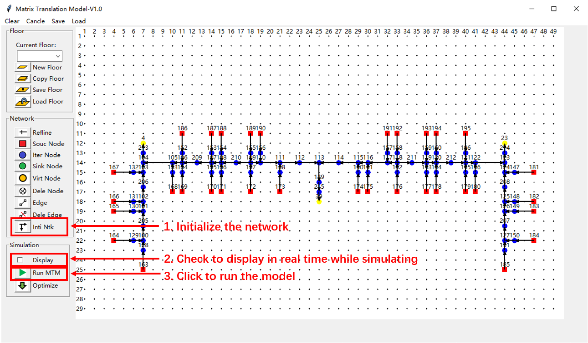

#Introduction
Open source framework for simulating and optimizing pedestrian evacuation by using Matrix Translation Model, 
released under the GNU license and is written in Python. 
# Directory Structure
```commandline
│  DataStructure.py // Data structure used in 
│  MatrixTranslationModel.py // Functions related to the matrix translation model
│  RealTimeDis.py // Fucntions realated to real-time display
│  ShortestPath.py // Functions to solve the intitial shortest path by using Dijkstra Algorithm
│  Window.py // Functions related to user interface
│          
├─LOGO // Logo pictures of the button
│      中间节点.png
│      优化.PNG
│      保存楼层.png
│      删除节点.png
│      删除边.png
│      加载楼层.png
│      参考线.png
│      发点.png
│      圆logo.png
│      复制楼层.png
│      开始.png
│      收点.png
│      文本logo.png
│      新建楼层.png
│      无向边.png
│      生成路径.png
│      直线logo.png
│      矩形logo.png
│      虚拟节点.PNG
│      连接节点.jpg
│      连接节点.png
│      铅笔logo.png
│      
├─map // Network Samples
│      Floor 1-2.tm // The first two floors
│      Floor 1-3.tm // The first three floors 
│      Floor 1-4.tm // The first four floors
│      Floor 1.tm // The first floor
│      Sample1.tm // The sample of the turtorial
```
# Tutorials
Run "Window.py" to start the user interface. Then build a network, save a network, load a network, run the model, 
run the optimizing according the tutorials. 
## Build the network and run the model
1. Create a new floor: Click "New floor" to open the dialog, and enter the name and the number of the new floor.

2. Select the floor: Select the created floor from the combobox to focus on the selected floor. 

3. Create nodes: Click the "Souc Node", "Inter Node", and "Sink Node" to add a source node, an intermediate node, 
and a sink node, respectively. 

4. Create edges: Click "Edge" to add the edge between two nodes. Press and hold the left mouse button to go through 
the two nodes in turn, and an edge will be created between the two selected nodes. Five properties need to be specified
by using a dialog before creating the edge.

5. Create another floor: Click "New floor" to open the dialog, and enter the name and the number of the new floor. 
Both "Floor name" (string format) and "Floor number" (int format) should be unique. Selected the new added floor to 
focus on it. A virtual node should be added on the new built floor, and a dialog will be created to inquire what is 
the actual node of the virtual node. That means the virtual node is actually a node of the adjacent floor. 


6. Run with real time display: Select the floor to be displayed at first, click "Inti Ntk" to initialize 
the evacuation path secondly, then enable the checkbox of real-time display, at last click "Run MTM" to run the 
model. The display results will be demonstrated by a pop-up window. When the run ends, the results will be shown 
by a pedestrian number-evacuation time curve. No real-time display will be provided if "Display" is not checked. 


7. Save the network: Click "save" button in the navigation bar to save the network.

## Load the network and run the model
1. Load the network: Click "load" button in the navigation bar to load the network.

2. Run with real-time display: Click "Inti Ntk", check "Display", and click "Run MTM" in sequence to run the model 
with real-time display.


## Run optimization
Build or load a network first, then click "Inti Ntk" and "Optimize" in sequence to run the optimizing of the evacuation 
path. When the optimizing is finished, the results will be summarized by using two figures: the first one is the 
evacuation processes in different iterations, amd the second one is the clear time of different exits during the 
optimizing. 

# Support
Contact us for any support issues by [e-mail](huangzy@usst.edu.cn).
# License
Matrix Translation Model-V1.0 is free software: you can redistribute it and/or modify it under the terms of the 
GNU Lesser General Public License as published by the Free Software Foundation, either version 3 of the License, or any later version.
Matrix Translation Model-V1.0 is distributed in the hope that it will be useful, but WITHOUT ANY WARRANTY; without even 
the implied warranty of MERCHANTABILITY or FITNESS FOR A PARTICULAR PURPOSE. 
See the [GNU General Public License](http://www.gnu.org/licenses/) for more details.
# Disclaimer
In no event shall Matrix Translation Model-V1.0 be liable to any party for direct, indirect, special, incidental, or consequential damages, 
including lost profits, arising out of the use of this software and its documentation, even if JuPedSim has been advised 
of the possibility of such damage.
